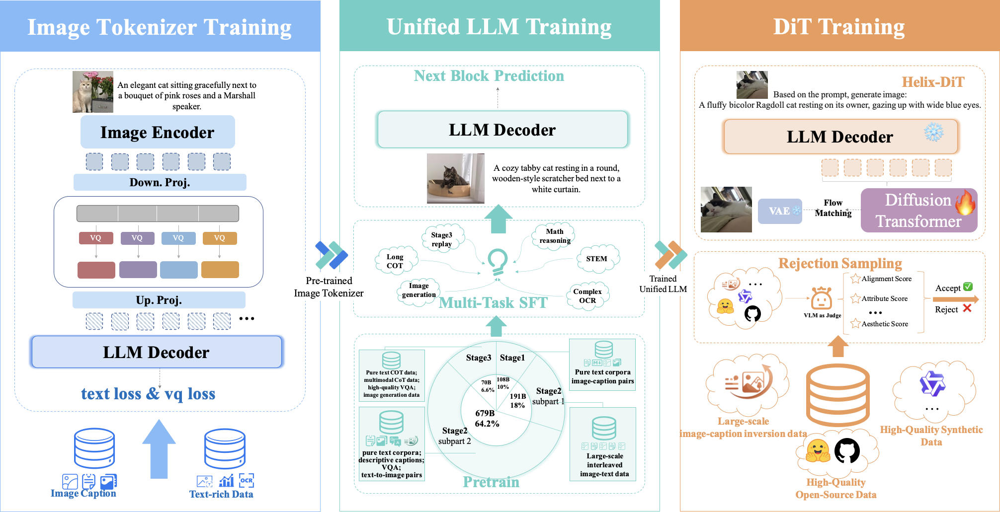

# Kelix

[Paper](https://arxiv.org/pdf/2602.09843) | [Kelix-DiT (HF)](https://huggingface.co/OpenOneRec/Kelix-DiT) | [Kelix-SFT (HF)](https://huggingface.co/OpenOneRec/Kelix-SFT)

<p align="center">
  
</p>

<p align="center"><b>Figure 1:</b> The auto-regressive training workflow of Kelix, including the Kelix Tokenizer, the Unified LLM, and the Image DiT de-tokenizer.</p>

## Introduction

**Kelix** is a fully discrete autoregressive unified multimodal model by the OneRec Team. It closes the long-standing understanding gap between discrete and continuous visual representations, unifying **multimodal understanding** and **image generation** under a single autoregressive objective.

The name *Kelix* is a portmanteau of **K**uaishou and h**elix** — just as the DNA double helix encodes the full complexity of life using only four discrete nucleotide bases (A, T, C, G), Kelix encodes rich visual semantics using discrete tokens.

### Design Philosophy

Most vision–language models (VLMs) rely on a hybrid interface — discrete text tokens paired with continuous ViT features — and are biased toward understanding. Fully autoregressive unified models that use **discrete** visual tokens have historically suffered from an information bottleneck: a single discrete code carries far less information than the continuous embedding it replaces, which degrades multimodal understanding (especially on text-rich tasks such as OCRBench).

Kelix addresses this with a modular *Tokenizer → LLM → Detokenizer* pipeline built on two principles: (1) **strong scaling potential** — high sample efficiency, high MFU, and a unified space for cross-modal transfer; (2) **maximum compatibility with the LLM ecosystem** — reusing open foundation models, training frameworks, and deployment toolchains.

### Architecture

| Component | Description |
|---|---|
| **Kelix-Tok** | Multi-token vision tokenizer. NaViT-style vision encoder (initialized from Keye-VL 1.5) + multi-token VQ with `N=8` independent sub-codebooks (total size `S=65,536`, sum-pooled on the encoder side). Codebooks K-means initialized on 10M+ images, trained with SimVQ to maximize utilization and mitigate collapse. |
| **Kelix-LLM** | Unified autoregressive backbone (Qwen3-8B) with Block Encoder / Block Decoder and a **Next-Block Prediction (NBP)** paradigm — text block size 2, visual block size `N+1=9`. Vocabulary expanded by 65,536 visual entries. |
| **Kelix-DiT** | Diffusion-based image de-tokenizer (SANA-DiT based, flow-matching), conditioned on the LLM's last hidden states between vision start/end tokens. Renders 1024×1024 images. |
| *(frozen, external)* | DC-AE-F32C32 latent VAE (32× spatial downsampling → 32×32 latent) — from [`Efficient-Large-Model/SANA1.5_1.6B_1024px_diffusers/vae`](https://huggingface.co/Efficient-Large-Model/SANA1.5_1.6B_1024px_diffusers/tree/main/vae). |

### Key Results

**Image understanding**

| Benchmark | SEED-Bench | RealWorldQA | MMBench-EN | AI2D | MMMU | MathVista | ChartQA | TextVQA | OCRBench |
|---|---|---|---|---|---|---|---|---|---|
| Score | 76.0 | 72.1 | 80.2 | 82.4 | 54.1 | 76.5 | 83.0 | 81.4 | **86.7** |

**Image generation**

| Benchmark | GenEval (Overall) | WISE (Overall) | DPG-Bench (Overall) |
|---|---|---|---|
| Score | **87.6** | **57.0** | **85.5** |

Highlights (see the [technical report](https://arxiv.org/pdf/2602.09843) for full tables):
- **OCRBench 86.7** — matching Qwen2.5-VL-7B (86.4), **+23%** over the previous best discrete unified model X-Omni (70.4). First discrete-token unified model to close the gap with continuous-feature VLMs on text-rich tasks.
- **MathVista 76.5** — surpasses the 14B Bagel (73.1) and the 30B Manzano (73.3) despite a much smaller parameter count.
- **GenEval 87.6** — SOTA among discrete-tokenization unified models, **+0.6** over the 27B Qwen-Image.
- **WISE 57.0** — beats all continuous-tokenization unified models and larger dedicated T2I models (e.g., FLUX.1-dev 12B, 50.0).
- **DPG-Bench 85.5** — competitive with X-Omni (7B, 87.7) **without** using reinforcement learning.

## Model Zoo

| Model | Description | HuggingFace |
|---|---|---|
| **Kelix-DiT** | Pretraining-stage diffusion-based image de-tokenizer. | [`OpenOneRec/Kelix-DiT`](https://huggingface.co/OpenOneRec/Kelix-DiT) |
| **Kelix-SFT** | Complete end-to-end release (Kelix-Tok + Kelix-LLM + Kelix-DiT SFT). | [`OpenOneRec/Kelix-SFT`](https://huggingface.co/OpenOneRec/Kelix-SFT) |

## Demos

This directory ships two ready-to-run demos. All the heavy lifting (model loading, chat template, flow-matching sampling, VAE decode) lives in [`kelix_utils.py`](./kelix_utils.py); the demos themselves are just a few lines showing the core flow: **load model → write prompt → generate**.

### Demo 1: Image Understanding + Image-Token Generation — `demo_kelix.py`

Loads the Kelix unified model and runs two tasks:
1. **Image understanding** — feeds a test image + question, prints the text answer.
2. **Image-token generation** — gives a text prompt, generates discrete visual tokens.

**Run:**
```bash
python examples/sana/ar_dit/opensource/demo_kelix.py

# Override the checkpoint dir:
KELIX_DIR=/path/to/release_sft python examples/sana/ar_dit/opensource/demo_kelix.py
```

**Core code** (full file: [`demo_kelix.py`](./demo_kelix.py)):

```python
from kelix_utils import load_ar_model, load_processor, make_test_image, chat, generate_image_tokens

# 1. Load the Kelix unified model (Kelix-Tok + Kelix-LLM).
model = load_ar_model()
processor = load_processor()

# 2. Image understanding: image + question -> text answer.
answer = chat(model, processor, messages=[
    {"role": "user", "content": [
        {"type": "image", "image": make_test_image()},
        {"type": "text", "text": "What's in the image? Describe it briefly."},
    ]}
])
print(f"Kelix: {answer}")

# 3. Image-token generation: text prompt -> discrete visual tokens.
content, image_tokens = generate_image_tokens(model, processor, "Generate an image of a cute cat.")
print(f"Kelix (raw tokens): {content}")
```

**Expected output:**
```
Loading Kelix from /mmu_mllm_hdd_2/lingzhixin/output/release/muse/release_sft ...

============================================================
Task 1: Image Understanding
============================================================
User : What's in the image?
Kelix: The image shows a solid black circle centered on a white background. ...

============================================================
Task 2: Image-Token Generation
============================================================
User : Generate an image of a cute cat.
Kelix (raw tokens): ...
Extracted 1 image-token group(s), shapes: [torch.Size([...])]
```

### Demo 2: Text-to-Image Generation — `demo_kelix_t2i.py`

Loads the Kelix AR model + Kelix-DiT + DC-AE VAE, then generates a 1024×1024 image from a text prompt.

**Pipeline:** `prompt → AR model (hidden states) → DiT flow-matching sampling → VAE decode → PIL.Image`

**Run:**
```bash
python examples/sana/ar_dit/opensource/demo_kelix_t2i.py
python examples/sana/ar_dit/opensource/demo_kelix_t2i.py --prompt "Generate an image of a cute cat."
python examples/sana/ar_dit/opensource/demo_kelix_t2i.py --output out.png

# Override paths via env vars:
KELIX_DIR=/path/to/release_sft DIT_DIR=/path/to/release_dit \
VAE_DIR=/path/to/vae python examples/sana/ar_dit/opensource/demo_kelix_t2i.py
```

**Core code** (full file: [`demo_kelix_t2i.py`](./demo_kelix_t2i.py)):

```python
from kelix_utils import (
    load_ar_model, load_dit, load_processor, load_vae_model, generate_image,
)

# 1. Load Kelix AR model + Kelix-DiT + DC-AE VAE.
ar_model = load_ar_model()
ar_processor = load_processor()
dit = load_dit()
vae = load_vae_model()

# 2. Write a prompt -> 3. generate a 1024x1024 image.
img = generate_image(ar_model, ar_processor, dit, vae, "Generate an image of a cute cat.")
img.save("./kelix_t2i_demo.png")
```

**Key config (override via env vars):**

| Env var | Default | Purpose |
|---|---|---|
| `KELIX_DIR` | `/mmu_mllm_hdd_2/lingzhixin/output/release/muse/release_sft` | Kelix AR model (Tok + LLM) |
| `DIT_DIR` | `/mmu_mllm_hdd_2/lingzhixin/output/release/muse/release_dit` | Kelix-DiT de-tokenizer |
| `VAE_DIR` | `/llm_reco_ssd/zhouyang12/models/SANA1.5_1.6B_1024px_diffusers/vae/` | Frozen DC-AE VAE |
| `MODEL_CONFIG_OVERRIDES` | `model_max_length=720` | DiT config override (must match checkpoint) |

**Expected output:**
```
Loading AR model from .../release_sft ...
Loading DiT from .../release_dit ...
[kelix] DiT config overrides: {'model_max_length': 720}
Loading VAE from .../SANA1.5_1.6B_1024px_diffusers/vae/ ...

Prompt: Generate an image of a cute cat.
[kelix] input_ids shape: (1, 21)
[kelix] cond_embeds: (1, 720, 2304)  cond_mask: (1, 1, 1, 720)
[kelix] sampling step 10/50
[kelix] sampling step 20/50
[kelix] sampling step 30/50
[kelix] sampling step 40/50
[kelix] sampling step 50/50

Saved: ./kelix_t2i_demo.png  ((1024, 1024))
```

### `kelix_utils.py` — shared API

Both demos import from [`kelix_utils.py`](./kelix_utils.py), which exposes:

| Function | Description |
|---|---|
| `load_ar_model(ar_dir=KELIX_DIR)` | Load Kelix-Tok + Kelix-LLM (local, non-distributed). |
| `load_processor(ar_dir=KELIX_DIR)` | Load the AutoProcessor (chat template + tokenizer + image processor). |
| `load_dit(model_dir=DIT_DIR)` | Load Kelix-DiT (applies `MODEL_CONFIG_OVERRIDES` automatically). |
| `load_vae_model(vae_dir=VAE_DIR)` | Load the frozen DC-AE VAE. |
| `make_test_image(size=224)` | Draw a test image (black circle on white) for the understanding demo. |
| `chat(model, processor, messages, max_new_tokens=256)` | Multi-turn chat: messages → text response. |
| `generate_image_tokens(model, processor, prompt, max_new_tokens=450)` | Text prompt → (decoded_text, image_token_groups). |
| `generate_image(ar_model, ar_processor, dit, vae, prompt)` | Text prompt → 1024×1024 PIL.Image (full AR→DiT→VAE pipeline). |

## Directory Contents

| File | Description |
|---|---|
| `README.md` | This file — model intro + demos. |
| `README_Kelix-DiT.md` | HuggingFace model card for `OpenOneRec/Kelix-DiT`. |
| `README_Kelix-SFT.md` | HuggingFace model card for `OpenOneRec/Kelix-SFT`. |
| `kelix_utils.py` | Shared loaders + pipeline (used by both demos). |
| `demo_kelix.py` | Demo 1: image understanding + image-token generation. |
| `demo_kelix_t2i.py` | Demo 2: text-to-image generation (1024×1024). |
| `assets/fig3.png` | Training pipeline figure (Figure 1). |
| `fig3.pdf` | Source PDF of the training pipeline figure. |
| `kelix_report.tex` | LaTeX source of the technical report. |
| `upload_to_hf.py` | Upload bf16-sharded model checkpoints to HuggingFace. |
| `upload_readmes.py` | Upload HF model cards + assets to HuggingFace. |
| `upload_github/` | Code to push this release to the `Kuaishou-OneRec/Kelix` GitHub repo. |

## Citation

If you find Kelix useful, please cite our technical report.

```bibtex
@article{kelix2026,
  title   = {Kelix Technique Report: Closing the Understanding Gap of Discrete Tokens in Unified Multimodal Models},
  author  = {Kuaishou Technology},
  journal = {arXiv preprint arXiv:2602.09843},
  year    = {2026},
  url     = {https://arxiv.org/abs/2602.09843}
}
```

## License

Please contact the OneRec Team for the license of the Kelix series. The base components (Qwen3-8B, SANA-DiT, DC-AE, Keye-VL / NaViT) are subject to their respective original licenses.
